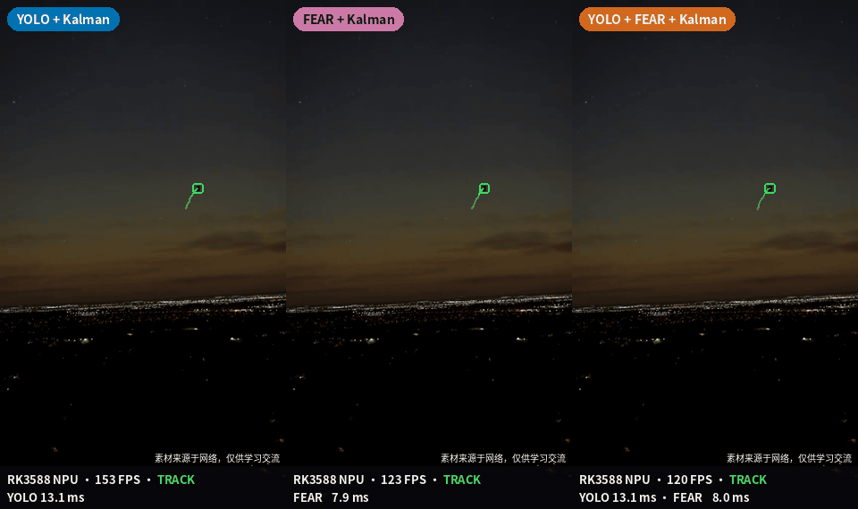
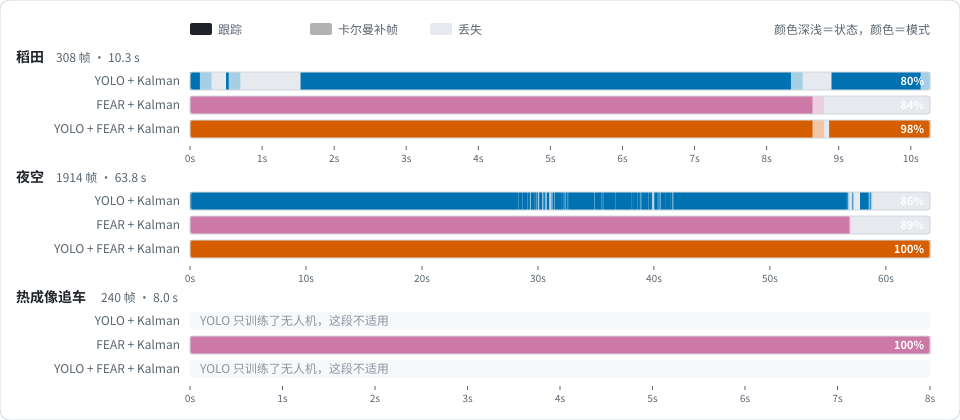
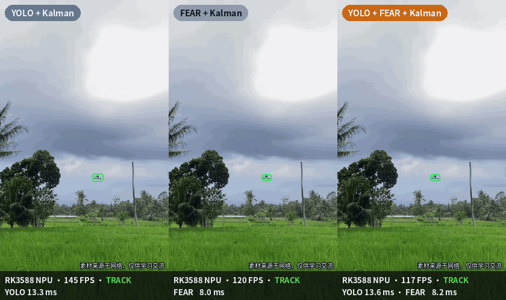
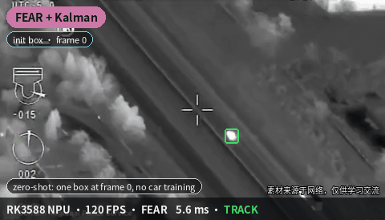
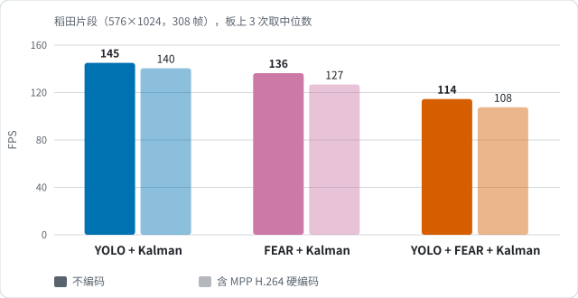
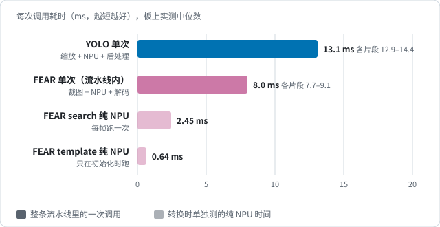
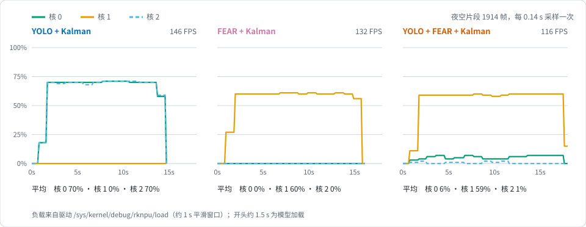

# RK3588 Anti-UAV Tracker

**YOLO + FEAR + Kalman，在 RK3588 NPU 上实时检测并跟踪无人机。** 三个 NPU 核分工：YOLO 占核 0 和核 2，FEAR 占核 1。竖屏 576×1024 视频上，三合一模式约 **115 FPS**；连同 MPP 硬件编码输出视频约 **108 FPS**。

<p align="center">
  
  <br><sub>夜空片尾，无人机只剩 8 个像素左右：单用 YOLO 或单用 FEAR 都丢了，三合一一直跟到最后。底栏是板上实测的 FPS 和各模型耗时</sub>
</p>

- **FEAR 孪生跟踪网络全部跑在 NPU 上**：官方预训练权重一个不改，只改模型的输入输出边界。template 47 个算子、search 76 个算子全在 NPU 上，search 单次 2.45 ms
- **零样本跟踪**：FEAR 不认类别，第一帧框一下就能跟，无人机、汽车都行
- **三种模式开箱对比**：同一个脚本，用 `--mode` 切换
- **模型、代码、测试视频全部开源**

## 三种模式

| 模式 | 怎么开始 | 每帧做什么 | 优点 | 短板 |
|---|---|---|---|---|
| **YOLO + Kalman** | 自动，YOLO 检出即锁定 | 每帧 YOLO 检测，卡尔曼负责关联、平滑、短时补帧 | 不用人工框；目标丢了能自己找回 | 只认训练过的目标，数据没覆盖到的尺寸、场景就会断 |
| **FEAR + Kalman** | 第一帧手动框一下 | FEAR 在卡尔曼预测的位置附近找同一个目标 | 不用训练，什么目标都能跟 | 跟丢后找不回来；目标变大或变小以后，模板会跟不上 |
| **YOLO + FEAR + Kalman** | 自动（也可以手动框） | FEAR 每帧跟踪；YOLO 每 15 帧复核一次：校正位置，目标尺寸变化大时刷新 FEAR 模板，跟丢时全图找回 | 跟得最久 | YOLO 只认无人机，跟其他目标时复核帮不上忙 |

**测试阶段推荐用 FEAR + Kalman：不用训练，标注两个左右样本（例如第一帧框出目标）就有不错的效果。YOLO 则要针对目标收集各种场景、尺寸、光照的数据来训练。**

## 效果

> 数字均为 RK3588 板上实测。"跟住"指输出状态为跟踪，不含卡尔曼补帧和丢失；测试视频没有标注真值，框的位置已逐段人工核对。视频左上角标模式，底栏标实时 FPS 和每个模型的推理耗时。

| 视频 | YOLO + Kalman | FEAR + Kalman | YOLO + FEAR + Kalman |
|---|---:|---:|---:|
| 稻田（308 帧） | 79.9% | 84.1% | **97.7%** |
| 夜空（1914 帧） | 86.2% | 89.1% | **100%** |
| 热成像追车（240 帧） | — | **100%** | — |



### 稻田：FEAR 跟丢后，三合一能接回来

<p align="center"></p>

- **YOLO + Kalman**：开头 1.5 秒检测断断续续
- **FEAR + Kalman**：第 259 帧 FEAR 分数骤降，补帧 5 帧后判定丢失，之后就不再找了
- **YOLO + FEAR + Kalman**：同一时刻也短暂失锁，但丢失后还在继续找：YOLO 全图找，FEAR 在预测位置找。加上 YOLO 之前已经按目标的当前大小刷新过 FEAR 模板，第 266 帧重新锁上，一直跟到片尾

### 夜空：小到几个像素也不丢

见页首 GIF。片尾无人机越飞越远：FEAR + Kalman 的模板还是开头那个大小，第 1705 帧起分数掉下来，很快跌到 0.1 以下。三合一在第 1695 帧由 YOLO 把模板刷新成当前大小，之后分数一直在 0.99 以上，跟到片尾。

### 热成像追车：没训练过车，也能跟

<table><tr>
<td width="40%"></td>
<td>

直升机热成像镜头追车（前 8 秒）。YOLO 只训练过无人机，这段只用 **FEAR + Kalman**：第一帧框一下，240 帧全程跟住，单次 7.7 ms。

这也是三种模式分开提供的原因：跟的不是训练过的目标时，别让 YOLO 参与复核。

</td></tr></table>

完整对比视频（原分辨率、全长）在 [assets/videos/](assets/videos/)。

## 速度与 NPU 占用

RK3588 的 NPU 有三个核：核 0、核 1、核 2，每个核可以单独跑一个模型。本项目的分工如下：

| NPU 核 | 跑什么 | 说明 |
|---|---|---|
| 核 0 | YOLO 实例 1 | 两个 YOLO 实例并行处理不同的帧，互不等待 |
| 核 1 | FEAR（template + search） | 每帧都要用上一帧的结果，只能一帧接一帧地跑 |
| 核 2 | YOLO 实例 2 | 同核 0 |

<p>


</p>

- **YOLO + Kalman 帧率最高**：两个 YOLO 实例在核 0、核 2 上并行
- **FEAR 单次 8.0 ms，其中纯 NPU 只有 2.45 ms**：其余是裁图和调用开销，后续改成全 C++ 来压缩
- **三合一最慢**：FEAR 之外还要调度 YOLO 复核



- **YOLO + Kalman**：核 0、核 2 各约 70%，核 1 空闲
- **FEAR + Kalman**：只有核 1 在跑，约 60%。FEAR 是串行的，想再快，得先压缩裁图和调用开销
- **三合一**：核 1 约 60%。YOLO 每 15 帧才复核一次，核 0、核 2 只用了 1%～6%。NPU 余量还很大，可以用来同时跟多个目标或接多路相机

## 融合规则里最关键的两条

1. **YOLO 没检到，不算 FEAR 错。** 只有 YOLO 在别处以 0.5 以上的置信度检到目标、并且连续 3 次和 FEAR 对不上，才判 FEAR 跟丢。YOLO 什么都没检到，或者只检到低分目标（夜空里的星星就常被检成低分目标），一律不否决 FEAR。
2. **目标变大变小时，用 YOLO 的框刷新 FEAR 模板。** FEAR 输出的框大小跟着模板走。YOLO 复核时如果两个框的面积差到 1.5 倍以上，就用 YOLO 的框重新生成模板。

在 UCAS Anti-UAV300 出画重入片段上做回归测试（有真值）：IoU ≥ 0.5 的帧从 83.3% 提到 91.1%，完全丢失的帧从 8.9% 降到 2.7%。状态机的完整说明见 [docs/FUSION_STATE_MACHINE.md](docs/FUSION_STATE_MACHINE.md)。

## FEAR 是怎么转成 RKNN 的

FEAR-XS（[PinataFarms/FEARTracker](https://github.com/PinataFarms/FEARTracker)）是轻量孪生跟踪网络：FBNet 主干 + 相关层 + 分类/回归头。**权重和激活函数都没动**：主干本来就是 ReLU，不需要像 YOLO 那样替换激活函数后重新训练。只改了模型的输入输出边界：

| 改动 | 原版 | RKNN 版 | 为什么 | 精度影响 |
|---|---|---|---|---|
| Exp 移出模型 | bbox 头最后一个 `Exp` 在模型内 | 模型输出 logits，`np.exp` 在 CPU 上算 | 模型里唯一的 Exp 会被 RKNN 放到 CPU 上执行，打断 NPU 计算 | 最大误差 7.6e-6 |
| 归一化移进 RKNN 配置 | CPU 上做 `(x/255 − mean) / std` | 用 RKNN 的 `mean_values / std_values`，直接输入 uint8 | 少几个算子，也省掉 CPU 逐像素运算 | 数学等价 |
| 固定尺寸，拆成两个模型 | 动态尺寸 | template 128×128（只跑一次）+ search 256×256（每帧） | RKNN 需要静态尺寸；模板不必每帧重算 | 无 |

还试过把 Exp 改写成 `1/Sigmoid(−x) − 1` 留在 NPU 上，结果除法又被放到 CPU 上，反而更慢，所以放弃了。

| | 改前 | 改后 |
|---|---:|---:|
| search（每帧） | 2.75 ms | **2.45 ms** |
| template（初始化） | 0.72 ms | **0.64 ms** |
| 模型内 CPU 算子 | 1 | **0** |

逐项数据和复现步骤见 [docs/FEAR_RKNN_CHANGES.md](docs/FEAR_RKNN_CHANGES.md)。

## 快速开始

板端环境：RK3588，librknnrt 2.3.2，GStreamer MPP 插件，librga，Python 3 + `rknn-toolkit-lite2`、NumPy、OpenCV。

```bash
git clone https://github.com/JA-cmd-wq/RK3588-AntiUAV-Tracker.git
cd RK3588-AntiUAV-Tracker

# 编译 MPP/RGA 和 RKNN 的 C++ 封装（RKNN_INCLUDE 指向 rknn_api.h 所在目录）
bash tracker/build_native.sh
RKNN_INCLUDE=/path/to/rknn-toolkit2/rknpu2/runtime/Linux/librknn_api/include bash tracker/build_infer.sh

# 三种模式用同一个脚本；--init 是第一帧的框 x,y,w,h，FEAR + Kalman 必须给
python3 tracker/track3.py --mode fear_kalman      --video test_videos/rice_field.mp4 --out out/fear_kalman \
        --init '{"0":[243,596,26,15]}'
python3 tracker/track3.py --mode yolo_kalman      --video test_videos/rice_field.mp4 --out out/yolo_kalman
python3 tracker/track3.py --mode yolo_fear_kalman --video test_videos/rice_field.mp4 --out out/yolo_fear_kalman

# 完整流水线：输出带框的 mp4（MPP 硬件编码）
bash tracker/run_board.sh --video test_videos/rice_field.mp4 --output out/rice_field.mp4
```

| 视频 | `--init` |
|---|---|
| `rice_field.mp4` | `{"0":[243,596,26,15]}` |
| `night_sky.mp4` | `{"0":[245,449,25,21]}` |
| `car_thermal_8s.mp4` | `{"0":[338,194,16,17]}` |

`track3.py` 默认每种模式跑 3 遍不编码 + 2 遍带编码，取中位数。输出 `frames.csv`（逐帧状态、框、各模型耗时）和 `summary.json`。只想跑一遍，加 `--repeat-noenc 1 --repeat-enc 0`。

> 网上下载的 mp4 如果 GStreamer 报 `atom has bogus size`，先 remux：`ffmpeg -i in.mp4 -map 0:v -c copy -movflags +faststart out.mp4`

## 仓库结构

```
models/fear/      FEAR-XS FP16 rknn：template + search
models/yolo/      YOLOv8n INT8 rknn，单类 drone，偏重远处小目标
tracker/          板端跟踪流水线（MPP 硬解码 / RGA / 三核 NPU / 硬编码）
fear_to_rknn/     FEAR → ONNX → RKNN 转换脚本
test_videos/      测试视频
assets/           README 用的 GIF、图表、对比视频
docs/             FEAR 改动明细、流水线和状态机设计、测速记录
```

## 已知局限

- 这版 YOLO 训练数据有限，偏重远处小目标，**近处的大无人机反而检不到**；画面里目标很大时，主要靠 FEAR 来跟。想要更好的效果，见下一节自己训练
- FEAR + Kalman 跟丢后不会自己找回，需要 YOLO 或人工重新给框
- 现在是 Python 调度 + C++ 推理。FEAR 纯 NPU 2.45 ms，流水线里每次约 8 ms，多出来的是裁图、调用和格式转换开销，后续改成全 C++ 和 NPU 原生输入格式来压缩

## 用自己的数据训练 YOLO

仓库里的 YOLO 训练数据有限、效果一般，想要更好的效果，可以用自己场景的数据（远近、昼夜、不同背景，只标 `drone` 一类）在 [airockchip/ultralytics_yolov8](https://github.com/airockchip/ultralytics_yolov8) 上训练 640×640 的 YOLOv8n，用 `yolo export format=rknn` 导出 ONNX，再用 [rknn_model_zoo](https://github.com/airockchip/rknn_model_zoo) 的 `convert.py` 转成 INT8 RKNN，覆盖 `models/yolo/drone_yolov8n_int8.rknn` 或运行时加 `--yolo-model 你的模型.rknn` 即可，跟踪部分不用改。

## 测试视频说明

`test_videos/` 里的稻田、夜空、热成像追车三段视频**素材来源于网络，仅供学习交流**，请勿用于商业用途；如有侵权请提 issue，会第一时间删除。

## 致谢

- [FEARTracker](https://github.com/PinataFarms/FEARTracker)
- [Ultralytics YOLOv8](https://github.com/ultralytics/ultralytics)
- [Rockchip RKNN Toolkit2](https://github.com/airockchip/rknn-toolkit2)
- [Anti-UAV](https://github.com/ZhaoJ9014/Anti-UAV) 数据集（回归测试用）

## License

[AGPL-3.0](LICENSE)
